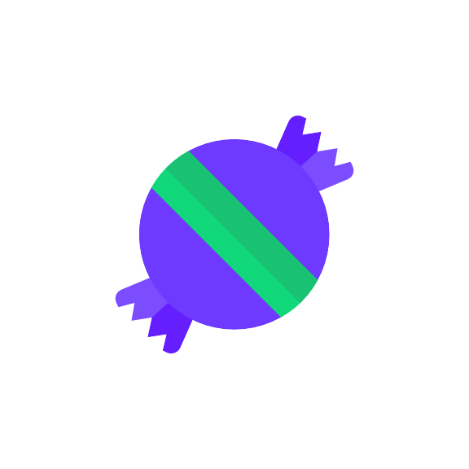

# CandyBar Icon Pack

[](https://github.com/SamNeill/Candybar/releases)
[](LICENSE)

A modern, feature-rich icon pack built with the CandyBar Dashboard. This icon pack brings a fresh, cohesive design to your Android device while maintaining compatibility with various launchers.

## Features

- **Extensive Icon Collection**: Carefully crafted icons with attention to detail
- **Regular Updates**: Continuous addition of new icons and improvements
- **Launcher Support**: Compatible with popular launchers including Nova, Apex, Lawnchair, and more
- **Material You Design**: Modern interface following Material Design guidelines
- **Icon Request System**: Built-in tool for requesting missing icons
- **Cloud Wallpapers**: Curated collection of matching wallpapers
- **Muzei Support**: Live wallpaper integration with Muzei
- **Premium Features**: Additional icons and exclusive content for supporters
- **Adaptive Icons**: Full support for Android's adaptive icon system
- **Dark Mode**: Seamless dark theme support

## Supported Launchers

- Nova Launcher
- Action Launcher
- Apex Launcher
- Lawnchair
- Smart Launcher
- Microsoft Launcher
- Niagara Launcher
- And many more!

## Getting Started

1. Download the app from your preferred store
2. Open the app and select your launcher
3. Apply the icon pack through your launcher's settings
4. Enjoy your freshly themed device!

## Download

[](https://play.google.com/store/apps/details?id=your.package.name)
[](https://www.amazon.com/your-app-link)

## Building from Source

### Prerequisites
- Android Studio Arctic Fox or newer
- JDK 11 or newer
- Android SDK (API 34)
- Gradle 8.5.2 or newer

### Setup
1. Clone the repository:
   ```bash
   git clone https://github.com/SamNeill/Candybar.git
   ```
2. Open the project in Android Studio
3. Sync project with Gradle files
4. Build the project

## Contributing

Contributions are welcome! If you'd like to contribute:

1. Fork the repository
2. Create your feature branch (`git checkout -b feature/AmazingFeature`)
3. Commit your changes (`git commit -m 'Add some AmazingFeature'`)
4. Push to the branch (`git push origin feature/AmazingFeature`)
5. Open a Pull Request

## License

```
Copyright 2024 Sam Neill

Licensed under the Apache License, Version 2.0 (the "License");
you may not use this file except in compliance with the License.
You may obtain a copy of the License at

       http://www.apache.org/licenses/LICENSE-2.0

Unless required by applicable law or agreed to in writing, software
distributed under the License is distributed on an "AS IS" BASIS,
WITHOUT WARRANTIES OR CONDITIONS OF ANY KIND, either express or implied.
See the License for the specific language governing permissions and
limitations under the License.
```

### CandyBar License
This project is based on the CandyBar Dashboard library. The original CandyBar project is licensed under the Apache License, Version 2.0.
